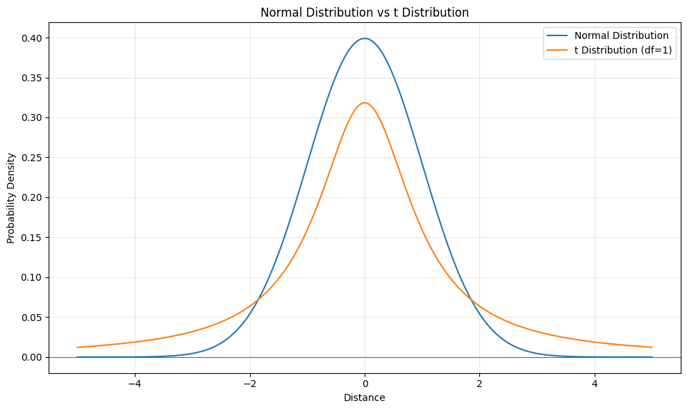
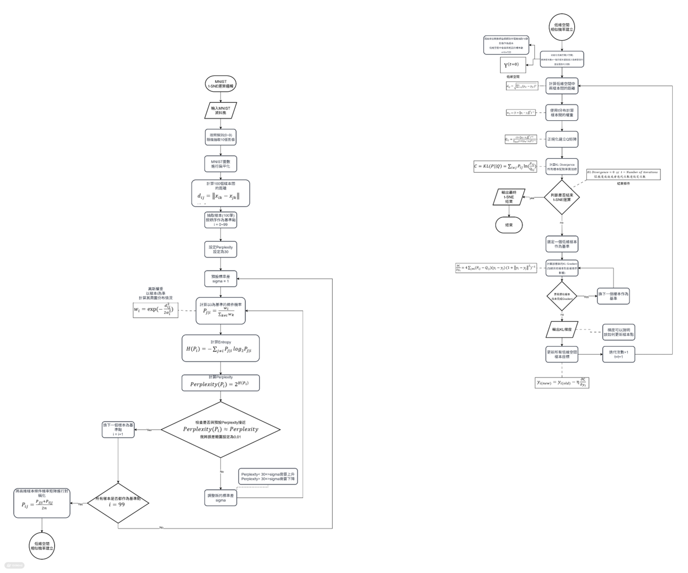

# Dimensional reduction：t-SNE

將高維資料樣本間的相關性映射至低維空間，盡可能保留原始資料的局部相似關係

=>希望在低維空間中，保留高維資料樣本間的鄰近關係

## t-SNE 簡介

t-SNE(t-Distributed Stochastic Neighbor Embedding)是一種常見的非線性降維

透過建立高維資料中的局部相似關係，將高維資料樣本映射至低維空間，持續調整低維空間樣本位置，使其盡可能保留原始資料的局部近鄰關係

### t-分布 在此的應用

t-分布具有Heavy Tail特性，使距離較遠的樣本仍保有較大的權重

=>讓不相似樣本在低維空間中能夠充分分離，降低Crowding Problem

## t-SNE流程

## 特色公式

### 1、Perplexity

$$perplexity(p_i)=2^{H(2P_i)}$$

$$H(P_i) = -sum_P{a} P_{j|i} log_2 P_{j|i} $$

