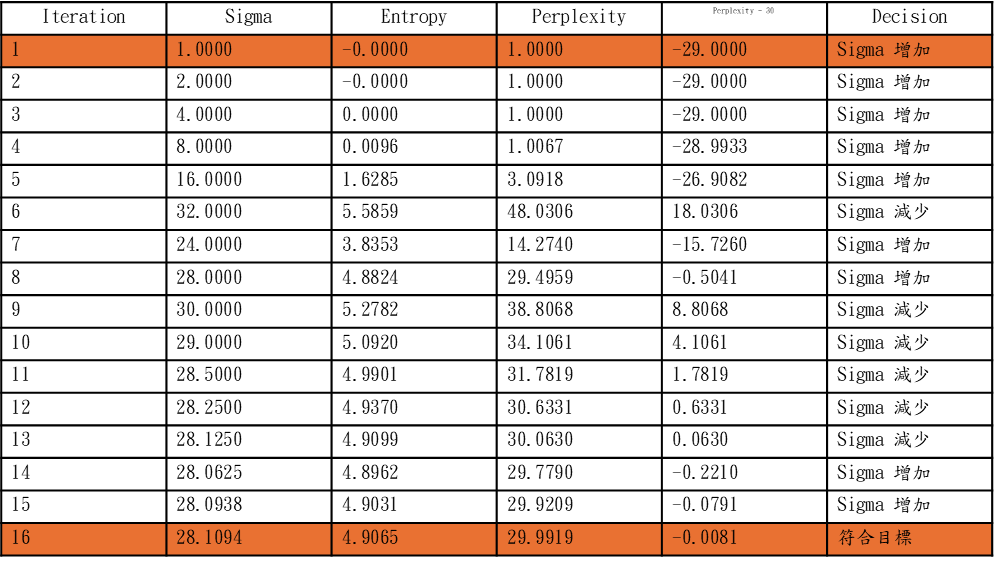
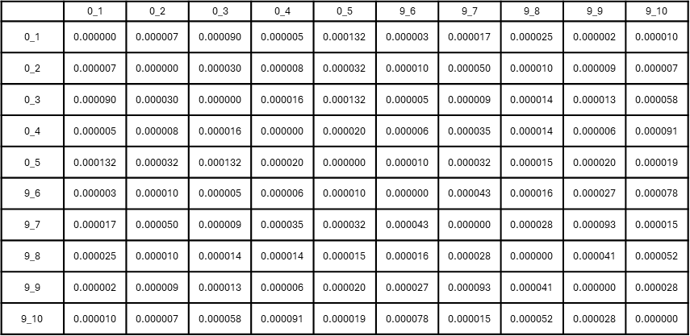

# Dimensional reduction：t-SNE

將高維資料樣本間的相關性映射至低維空間，盡可能保留原始資料的局部相似關係

=>希望在低維空間中，保留高維資料樣本間的鄰近關係

## t-SNE 簡介

t-SNE(t-Distributed Stochastic Neighbor Embedding)是一種常見的非線性降維

透過建立高維資料中的局部相似關係，將高維資料樣本映射至低維空間，持續調整低維空間樣本位置，使其盡可能保留原始資料的局部近鄰關係

### t-分布 在此的應用

t-分布具有Heavy Tail特性，使距離較遠的樣本仍保有較大的權重

=>讓不相似樣本在低維空間中能夠充分分離，降低Crowding Problem

## t-SNE流程

## 特色公式

在 t-SNE 中，主要比較兩個相似度機率分布：

- **P**：高維空間中的相似度分布，代表希望保留的原始資料局部關係
- **Q**：低維空間中的相似度分布，代表目前低維資料所呈現的局部關係

t-SNE 的目的就是透過持續調整低維資料的位置，使 **Q 盡可能接近 P**

### 1、Perplexity

$$perplexity(p_i)=2^{H(P_i)}$$

$$H(P_i) = -\sum_{j\neq i}{} P_{j|i} log_2 P_{j|i} $$

Perplexity 用來控制高維空間中的局部鄰域尺度，透過調整 $\sigma_i$，決定每個樣本應該以多大的範圍建立相似關係，進而影響高維相似度分布 **P** 的建立

### 2、KL Divergence 

$$KL(P||Q)=\sum_{j\neq i}{}P_{ij} ln(\frac{P_{ij}}{Q_{ij}}) $$

KL Divergence 用來衡量高維相似度分布P與低維相似度分布Q之間的差異

透過最小化 KL Divergence，使低維空間的相似關係Q盡可能接近高維空間的目標關係P

### 3、KL Gradient

$$\frac{\partial KL(P||Q)}{\partial y_i} = 4\sum_{j\neq i}{} (P_{ij}-Q_{ij}) (y_i-y_j)(1+||y_i-y_j||^{2})^{-1}$$

KL Divergence 只能判斷目前P與Q差多少，但無法直接告訴低維樣本應該往哪裡移動

因此透過 KL Gradient 計算 KL Divergence 對低維座標 $y_i$ 的梯度，決定樣本在低維空間中的調整方向，再持續更新位置，使Q逐漸接近P

## t-SNE演算法完整流程與實驗解釋

演算法主要可拆成三個部分

1、目標高維空間建立

2、目前狀態低維空間

3、優化與迭代

將實例MNIST資料集載入，已了解t-SNE是如何進行演算

## MNIST資料集簡單介紹

MNIST 為一種手寫數字的資料庫，將手寫的 0~9 透過 $28 \times 28$ 的像素格儲存

每張影像共有 784 個變數

像素值為 0~255

此處不進行資料處理，僅介紹資料如何進入 t-SNE 演算法

MNIST 分成兩種資料集 *Train* 及 *Test*

    Train ：60000
    Test ：10000

本次實驗從 Train 的 60000 筆資料中抽取 100 筆樣本進行 t-SNE 演算法流程介紹

使用 100 筆樣本的原因：

=> 樣本數較少，能夠專注於觀察 t-SNE 演算法各步驟的變化

舉例：手寫數字 5

## 輸入資料維度

從 Train 的 60000 筆資料中抽取 100 筆樣本進行實驗

每張 MNIST 影像為 $28 \times 28$，將影像攤平成 784 個變數：

$$
X \in \mathbb{R}^{100 \times 784}
$$

每一列(Column)：為一個變數，在這裡就是其中一個像素位置

    Pixel1、Pixel2、...、Pixel784

每一行(Row)：為一個樣本，在這裡為其中一張數字影像

    0、1、...、99

# 演算法步驟

## 目標高維空間建立

t-SNE 首先建立高維空間中的相似度分布 **P**，
作為低維空間需要盡可能保留的目標關係。

建立 P 的過程可分為：

1. 計算 $P(j|i)$
2. 以 Perplexity 作為目標進行調整
3. 將 $P(j|i)$ 與 $P(i|j)$ 進行對稱化

### Step 1－計算 $P(j|i)$

計算 $P(j|i)$，以 $x_i$ 為基準，建立 $x_i$ 與其他樣本 $x_j$ 的相似關係

$P_{j|i}$ 表示：

以 $x_i$ 為基準時，$x_j$ 在高維空間中與 $x_i$ 的相似程度

首先計算兩個樣本之間的距離

在本次實驗中使用歐式距離：

$$
d(x_i,x_j)=||x_i-x_j||
$$

例如，以樣本 $0\_1$ 為基準，
分別計算 $0\_1$ 與其他 99 個樣本之間的距離

距離越小，代表兩個樣本在原始高維空間中越接近

但距離本身只能表示樣本之間的遠近，
因此需要進一步將距離轉換為相似權重

使用 Gaussian 分布將距離轉換為相似權重：

$$
w_{ij}=
\exp
\left(
-\frac{||x_i-x_j||^2}{2\sigma_i^2}
\right)
$$

其中：

$x_i$：目前的基準樣本

$x_j$：與基準樣本比較的其他樣本

$||x_i-x_j||$：兩個樣本之間的距離

$\sigma_i$：以 $x_i$ 為基準時的局部尺度

因此：

$$
||x_i-x_j|| \downarrow
\Rightarrow
w_{ij} \uparrow
$$

$$
||x_i-x_j|| \uparrow
\Rightarrow
w_{ij} \downarrow
$$

也就是距離基準樣本越近的樣本，
Gaussian 權重越高；
距離越遠的樣本，權重越低

例如，以 $0\_1$ 為基準，
可以將其與其他樣本的距離轉換為對應的 Gaussian 權重

接著將所有相似權重進行正規化，
建立以 $x_i$ 為基準的條件機率：

$$
P_{j|i}=
\frac{
\exp(-||x_i-x_j||^2/2\sigma_i^2)
}{
\sum_{k\neq i}
\exp(-||x_i-x_k||^2/2\sigma_i^2)
}
$$

其中分子：

$$
\exp
\left(
-\frac{||x_i-x_j||^2}{2\sigma_i^2}
\right)
$$

代表以 $x_i$ 為基準，
將 $x_i$ 與 $x_j$ 之間的距離透過 Gaussian 分布轉換為相似權重

而分母：

$$
\sum_{k\neq i}
\exp(-||x_i-x_k||^2/2\sigma_i^2)
$$

則將 $x_i$ 與其他所有樣本的相似權重加總，
作為共同的比較基準

因此：

$$
P_{j|i}=
\frac{\text{樣本 }x_j\text{ 的相似權重}}
{\text{所有其他樣本的相似權重總和}}
$$

=> 將每個樣本的相似權重除以所有樣本的權重總和後，
即可將相似權重轉換為條件機率

對固定的基準樣本 $x_i$ 而言：

$$
\sum_{j\neq i}P_{j|i}=1
$$

因此，每一列代表一個基準樣本，
可以得到該基準樣本與其他 99 個樣本的完整條件機率分布

例如：

$$
P_{1|0\_1},P_{2|0\_1},...,P_{99|0\_1}
$$

其中：

- **列（Row）**：基準樣本 $x_i$
- **欄（Column）**：與基準樣本比較的其他樣本 $x_j$
- **儲存格**：對應的條件機率 $P_{j|i}$

以 `0_1` 為例，`0_1` 所在的列代表以 `0_1` 為基準，
該列各欄位則代表其他樣本相對於 `0_1` 的條件機率

=> 數值越大，代表該樣本相對於目前基準樣本的相似程度越高

=> 固定一個基準樣本時，該列所有樣本的條件機率加總為 1

因此 $P_{j|i}$ 並不是單純表示距離，
而是表示：

**在以 $x_i$ 為基準的情況下， $x_j$ 在整體相似關係中的相對重要程度**

### Step 2－以 Perplexity 做為目標進行調整

建立 $P_{j|i}$ 後，
需要進一步決定每個基準樣本應該保留多大的局部鄰域範圍

因此使用 Perplexity 控制高維空間中的**局部鄰域尺度**

首先由條件機率分布計算 Entropy：

$$
H(P_i)=
-\sum_{j\neq i}
P_{j|i}\log_2P_{j|i}
$$

再將 Entropy 轉換為 Perplexity：

$$
Perplexity(P_i)=
2^{H(P_i)}
$$

Perplexity 可視為條件機率分布中「有效鄰居數量」的尺度

因此不是直接選擇固定數量的鄰居，
而是希望條件機率分布呈現指定的有效鄰域尺度

例如設定：

$$
Perplexity_{target}=30
$$

代表希望目前的條件機率分布約維持在 30 個有效鄰居的尺度

因此，Perplexity 的目標是控制：

**相似關係應該集中在多大的局部範圍**

### Step 2-1－透過 $\sigma_i$ 調整相似度分布

Perplexity 並不是直接修改 $P_{j|i}$，
而是透過調整 Gaussian 分布的 $\sigma_i$，
改變相似權重與條件機率分布

當：

$$
\sigma_i \uparrow
$$

Gaussian 分布變寬：

$$
\Rightarrow
\text{較遠的樣本仍能保有一定權重}
$$

$$
\Rightarrow
P_{j|i}\text{ 的分布較分散}
$$

$$
\Rightarrow
Perplexity \uparrow
$$

反之，當：

$$
\sigma_i \downarrow
$$

Gaussian 分布變窄：

$$
\Rightarrow
\text{權重集中在較近的樣本}
$$

$$
\Rightarrow
P_{j|i}\text{ 的分布較集中}
$$

$$
\Rightarrow
Perplexity \downarrow
$$

因此會不斷調整 $\sigma_i$，
並重新計算 $P_{j|i}$、Entropy 與 Perplexity

其流程為：

$$
\sigma_i
\rightarrow
P_{j|i}
\rightarrow
H(P_i)
\rightarrow
Perplexity(P_i)
$$

比較目前 Perplexity 與目標值：

$$
Perplexity(P_i)
\approx
Perplexity_{target}
$$

若尚未達到目標，
則再次調整 $\sigma_i$ 並重新計算

本次實驗設定：

$$
Perplexity_{target}=30
$$

以其中一個樣本為例，
初始設定：

$$
\sigma_i=1
$$

此時：

$$
Perplexity=1
$$

遠低於目標值 30，

$$
\Rightarrow \sigma_i \text{ 增加}
$$

使 Gaussian 分布變寬，
讓更多樣本能夠保有較高的權重

透過反覆調整 $\sigma_i$，
使 Perplexity 逐漸接近目標值

實驗最後得到：

$$
\sigma_i=28.1094
$$

$$
Perplexity=29.9919
$$

與目標值 30 的差異為：

$$
|29.9919-30|=0.0081
$$

因此視為符合設定的目標

=> 每一個基準樣本都需要進行相同的調整過程

=> 不同樣本因為周圍資料分布不同，
最後得到的 $\sigma_i$ 也可能不同

=>Perplexity 並不是直接選擇固定數量的鄰居，
而是讓每個樣本找到適合自身局部資料分布的尺度

### Step 3－將 $P(j|i)$ 與 $P(i|j)$ 進行對稱化

當每一個樣本都完成 Perplexity 的調整後，
即可得到每個樣本作為基準時的條件機率

例如：

$$
P_{j|i}
$$

代表：

=>以 $x_i$ 為基準時，$x_j$ 與 $x_i$ 的相似程度

而：

$$
P_{i|j}
$$

代表：

=>以 $x_j$ 為基準時，$x_i$ 與 $x_j$ 的相似程度

由於每個樣本周圍的資料分布不同，
因此其 $\sigma_i$ 與 $\sigma_j$ 可能不同

即使是同一組樣本：

$$
P_{j|i}\neq P_{i|j}
$$

例如以 $x_i$ 為基準時，
$x_j$ 可能具有較高的相似機率；

但以 $x_j$ 為基準時，
由於 $x_j$ 周圍的資料分布不同，
$x_i$ 的相似機率可能不同

=> 因此條件機率具有方向性

為了建立不具有方向性的高維相似度分布，
需要將兩個方向的條件機率進行對稱化：

$$
P_{ij}=
\frac{P_{j|i}+P_{i|j}}{2N}
$$

其中 $N$ 為樣本數

本次實驗使用：

$$
N=100
$$

因此：

$$
P_{ij}=
\frac{P_{j|i}+P_{i|j}}{200}
$$

經過對稱化後：

- 將 $P_{j|i}$ 與 $P_{i|j}$ 兩個方向的相似關係整合
- 消除條件機率的方向性
- 將整體機率重新正規化

最終得到高維空間的聯合相似度分布：

$$
P
$$

**P 即為 t-SNE 在後續低維空間中希望盡可能保留的目標關係**
